<script type="text/javascript">
document.addEventListener("DOMContentLoaded", function() {
  document.querySelector("h1").className = "title";
});
</script>
<script type="text/javascript">
document.addEventListener("DOMContentLoaded", function() {
  var links = document.links;  
  for (var i = 0, linksLength = links.length; i < linksLength; i++)
    if (links[i].hostname != window.location.hostname)
      links[i].target = '_blank';
});
</script>


# regioneRld

The meaningful interpretation of overlaps between binding profiles of multiple 
chromatin regulators is a major challenge in epigenomics. To address this, 
in 2015 we published *[regioneR](https://bioconductor.org/packages/3.14/regioneR)* an R package that we developed for statistically  
assessing the association between genomic regions sets. Here, we now present the 
regioneRld, an R package that is the natural evolution of *[regioneR](https://bioconductor.org/packages/3.14/regioneR)* and allows to 
calculate the statistical association between multiple regions sets at the same 
time. RegioneRld is designed to work with multiple region set associations at 
the same time. To compare z-scores coming from multiple analysis, different 
strategies have been introduced to normalize the z-score and to improve the 
p-value calculations. Taken together, regioneRld aims to be a novel and precious 
addition to NGS tools and for whole genome analysis.


### regioneR limitations

*[regioneR](https://bioconductor.org/packages/3.14/regioneR)* is an R package created to test the associations between genomic region 
sets. The core of *[regioneR](https://bioconductor.org/packages/3.14/regioneR)* is a permutation test framework specifically designed 
to work in a genomic environment. The two main results can be summarized in two 
graphs. Figure 1A shows the association between the two region sets under study, 
highlighting the distance calculated in standard deviations from the random 
distribution. Figure 1B shows the local z-score, while a flat profile suggests a 
regional association, a narrow peak, as the one shown, indicates that the 
association is highly dependent on the exact location of the region.

(figure 1)

### Normalized Z-S

nZS = ZS / $\sqrt{n}$

regioneRld aims to integrate the framework previously developed for *[regioneR](https://bioconductor.org/packages/3.14/regioneR)*, 
to calculate associations of different region sets simultaneously. To compare
associations deriving from different region sets, we introduce the concept of 
normalized z-score, which allows not only to compare different association 
events but also to work with subsets of data and speed up the calculations.

(figure 2)

# Quick start

to calculate a crosswisePermTest starting from a list of Region Sets we can use 
the following code, the permutation process is time expensive and depend to a 
number of cores called by the parameter \code{\link{mc.cores}} (see *[regioneR](https://bioconductor.org/packages/3.14/regioneR)*)
The results of a follow code is state in the data folder of the package, to load in to the enviroment
use the command data("cw_Alien_RaR").
AlienGenome and AlienRSList arte described in the vignette  


```r
library("regioneRld")
```


```r
#NOT RUN
  set.seed(42)
  cw_Alien_ReG<-crosswisePermTest(Alist = AlienRSList,
                            sampling = FALSE,
                            mc.cores= 25,
                            ranFUN = "resampleGenome",
                            evFUN = "numOverlaps",
                            genome = AlienGenome,
                            ntimes= 1000
  )
#
```


```r
library(regioneR)
#> Loading required package: GenomicRanges
#> Loading required package: stats4
#> Loading required package: BiocGenerics
#> 
#> Attaching package: 'BiocGenerics'
#> The following objects are masked from 'package:dplyr':
#> 
#>     combine, intersect, setdiff, union
#> The following objects are masked from 'package:stats':
#> 
#>     IQR, mad, sd, var, xtabs
#> The following objects are masked from 'package:base':
#> 
#>     anyDuplicated, append, as.data.frame, basename, cbind, colnames, dirname, do.call, duplicated, eval, evalq, Filter, Find, get,
#>     grep, grepl, intersect, is.unsorted, lapply, Map, mapply, match, mget, order, paste, pmax, pmax.int, pmin, pmin.int, Position,
#>     rank, rbind, Reduce, rownames, sapply, setdiff, sort, table, tapply, union, unique, unsplit, which.max, which.min
#> Loading required package: S4Vectors
#> 
#> Attaching package: 'S4Vectors'
#> The following objects are masked from 'package:dplyr':
#> 
#>     first, rename
#> The following object is masked from 'package:tidyr':
#> 
#>     expand
#> The following objects are masked from 'package:base':
#> 
#>     expand.grid, I, unname
#> Loading required package: IRanges
#> 
#> Attaching package: 'IRanges'
#> The following objects are masked from 'package:dplyr':
#> 
#>     collapse, desc, slice
#> The following object is masked from 'package:purrr':
#> 
#>     reduce
#> Loading required package: GenomeInfoDb
library(RColorBrewer) # now we can delete this

data("cw_Alien")


cw_Alien_ReG<-makeCrosswiseMatrix(cw_Alien_ReG, pvcut = 1)
#> [1] "method selected for hclustering: average"
#>  complete   average    single   ward.D2    median  centroid  mcquitty 
#> 0.8180476 0.8988038 0.8296149 0.5552916 0.7384335 0.7921339 0.8474243

plotCrosswiseMatrix(cw_Alien_ReG, matrix.type = "crosswise")
```


```r

plotCrosswiseMatrix(cw_Alien_ReG, matrix.type = "correlation")
```


### Alien Genome and Alien RegionSet List

calculate the associations between genomic regionset can be very time consuming, 
to reduce the time of calculation and to better understand the interpretation of 
the regioneRld results, we create a fake genome of 4 chromosomes that we call 
Alien genome.

{width=85%}


```r

library("regioneRld")
```


```r

AlienGenome <-
  toGRanges(data.frame(
    chr = c("AlChr1", "AlChr2", "AlChr3", "AlChr4"),
    start = c(rep(1, 4)),
    end = c(1e4, 2e3, 1e3, 5e3)
  ))
```
We create 3 regionSet on AlienGenome each one of 100 region an called "regA","regB" and "regC"


```r
gnm <- AlienGenome

nreg=100

regA <-
  createRandomRegions(
    nregions = nreg,
    length.mean = 50,
    length.sd = 5,
    non.overlapping = TRUE,
    genome = gnm
  )

regB <-
  createRandomRegions(
    nregions = nreg,
    length.mean = 50,
    length.sd = 5,
    non.overlapping = TRUE,
    genome = gnm
  )

regC <-
  createRandomRegions(
    nregions = nreg,
    length.mean = 50,
    length.sd = 5,
    non.overlapping = TRUE,
    genome = gnm
  )
```
Using the regioneRld function similarRegionSet.R we create for each regionset 9
different regionset that shares a percentage (from 90 to 10) with the original one

```r

vectorPerc <- seq(0.1, 0.9, 0.1)

RsetA <-
  similarRegionSet(
    GR = regA,
    name = "regA",
    genome = gnm,
    vectorPerc = vectorPerc
  )
RsetB <-
  similarRegionSet(
    GR = regB,
    name = "regB",
    genome = gnm,
    vectorPerc = vectorPerc
  )
RsetC <-
  similarRegionSet(
    GR = regC,
    name = "regC",
    genome = gnm,
    vectorPerc = vectorPerc
  )
```

Using the same approach we create a regionset that share half a regions of regA 
and half of regB, from this region set we create a list of similar regions set using vectorPerc2


```r
vectorPerc2 <- seq(0.2, 0.8, 0.2)
regAB <- c(sample(regA, nreg / 2), sample(regB, nreg / 2))
RsetAB <-
  similarRegionSet(
    GR = regAB,
    name = "regAB",
    genome = gnm,
    vectorPerc = vectorPerc2
  )
```
last step is to create random RSs that not contain regions of regA, regB, regC, 
regAB and put all this regionsets in a unique regionSet List called AlienRSList


```r
reg_no_A <-
  createRandomRegions(
    nregions = nreg,
    length.mean = 10,
    length.sd = 5,
    non.overlapping = TRUE,
    genome = subtractRegions(gnm, regA)
  )

reg_no_B <-
  createRandomRegions(
    nregions = nreg,
    length.mean = 10,
    length.sd = 5,
    non.overlapping = TRUE,
    genome = subtractRegions(gnm, regB)
  )

reg_no_C <-
  createRandomRegions(
    nregions = nreg,
    length.mean = 10,
    length.sd = 5,
    non.overlapping = TRUE,
    genome = subtractRegions(gnm, regC)
  )
reg_no_AB <-
  createRandomRegions(
    nregions = nreg,
    length.mean = 10,
    length.sd = 5,
    non.overlapping = TRUE,
    genome = subtractRegions(gnm, c(regA, regB))
  )

Rset_NO <- list(reg_no_A, reg_no_B, reg_no_C, reg_no_AB)

names(Rset_NO) <- c("reg_no_A", "reg_no_B", "reg_no_C", "reg_no_AB")

RsetAB <-
  similarRegionSet(
    GR = regAB,
    name = "regAB",
    genome = gnm,
    vectorPerc = vectorPerc2
  )

AlienRSList <- c(RsetA, RsetB, RsetC, RsetAB, Rset_NO)

summary(AlienRSList)
#>           Length Class   Mode
#> regA01    100    GRanges S4  
#> regA02    100    GRanges S4  
#> regA03    100    GRanges S4  
#> regA04    100    GRanges S4  
#> regA05    100    GRanges S4  
#> regA06    100    GRanges S4  
#> regA07    100    GRanges S4  
#> regA08    100    GRanges S4  
#> regA09    100    GRanges S4  
#> regA      100    GRanges S4  
#> regB01    100    GRanges S4  
#> regB02    100    GRanges S4  
#> regB03    100    GRanges S4  
#> regB04    100    GRanges S4  
#> regB05    100    GRanges S4  
#> regB06    100    GRanges S4  
#> regB07    100    GRanges S4  
#> regB08    100    GRanges S4  
#> regB09    100    GRanges S4  
#> regB      100    GRanges S4  
#> regC01    100    GRanges S4  
#> regC02    100    GRanges S4  
#> regC03    100    GRanges S4  
#> regC04    100    GRanges S4  
#> regC05    100    GRanges S4  
#> regC06    100    GRanges S4  
#> regC07    100    GRanges S4  
#> regC08    100    GRanges S4  
#> regC09    100    GRanges S4  
#> regC      100    GRanges S4  
#> regAB02   100    GRanges S4  
#> regAB04   100    GRanges S4  
#> regAB06   100    GRanges S4  
#> regAB08   100    GRanges S4  
#> regAB     100    GRanges S4  
#> reg_no_A  100    GRanges S4  
#> reg_no_B  100    GRanges S4  
#> reg_no_C  100    GRanges S4  
#> reg_no_AB 100    GRanges S4
```
## Multi Permutation Test 
### Crosswise Analysis

CrosswisePermTest a package's core function, using it is possible to calculate the 
permutation test between all the combination of two RSs. Results of this function is an S4 object of class gMXR,
it contains 3 in three slots, *parameters*, *multiOverlaps* and *matrix*

* gMXR_obj
  + @parameters
    + Alist
    + Blist
    + sampling
    + fraction
    + min_sampling
    + ranFUN
    + evFUN
    + universe
    + adj_pv_method
    + max_pv
    + nc
    + matOrder
    + ntimes
  + @multiOverlaps
    + one field for each comparison
  + @matrix
    + GMat
    + GMat_pv
    + GMat_corX
    + GMat_corY
    + FitRow
    + FitCol


#### Parameters

In the slot "parameters" are present all the paramenteres used to obtain  the 
gMXR object."

```r
data("cw_Alien")
print(cw_Alien_ReG@parameters)
#> $Alist
#> [1] "AlienRSList"
#> 
#> $Blist
#> [1] "AlienRSList"
#> 
#> $sampling
#> [1] "FALSE"
#> 
#> $fraction
#> [1] "0.15"
#> 
#> $min_sampling
#> [1] "0.15"
#> 
#> $ranFUN
#> [1] "resampleGenome"
#> 
#> $evFUN
#> [1] "numOverlaps"
#> 
#> $universe
#> [1] "NULL"
#> 
#> $adj_pv_method
#> [1] "BH"
#> 
#> $max_pv
#> [1] "0.05"
#> 
#> $nc
#> NULL
#> 
#> $matOrder
#> NULL
#> 
#> $ntimes
#> [1] 1000
```
#### multiOverlaps

"multiOverlaps" slot contain a list of data frames.
For each element of Alist, will be create a data frame with 12 column and a nuber of rows equal to ther number of element present in Blist.
the 12 columns of the data frame represent:

+ order.id:       order of comparison
+ name:           name of Blist element 
+ n_regionA       number of regions od Alist using in the permutation test
+ n_regionB       number of regions od Blist using in the permutation test
+ z_score         calucalted z-score of permutation test
+ p_value         p.value of permutation test
+ n_overlaps      number of hits between Alist element and Belement (change name) 
+ mean_perm_test  mean of hits of permutated region set
+ sd_perm_test    standard deviation of hits in permutated region set
+ norm_zscore     z-scores normalized
+ std_zscore      z-score standardized* (maybe is better to eliminate)
+ adj_p_value     p.value adjusted 


```r
print(head(cw_Alien_ReG@multiOverlaps$regA01))
#>   order.id       name n_regionA n_regionB z_score     p_value n_overlaps mean_perm_test sd_perm_test norm_zscore   std_zscore adj.p_value
#> 1       40 reg_no_ABC       100       100 -0.3989 0.850149850          0          0.167    0.4186721    -0.03989 -0.001672877      0.8621
#> 2       39  reg_no_AB       100       100 -0.3994 0.854145854          0          0.157    0.3930719    -0.03994 -0.001572398      0.8621
#> 3       38   reg_no_C       100       100 -0.3863 0.862137862          0          0.146    0.3779244    -0.03863 -0.001462056      0.8621
#> 4       37   reg_no_B       100       100 -0.4092 0.846153846          0          0.169    0.4130492    -0.04092 -0.001693058      0.8621
#> 5       36   reg_no_A       100       100 -0.4014 0.854145854          0          0.155    0.3861659    -0.04014 -0.001552476      0.8621
#> 6       35      regAB       100       100 80.0679 0.000999001         44          0.299    0.5457993     8.00679  0.438320632      0.0027
```
#### matrix

when gMXR object is created the slot matrix will be NULL

```r
str(cw_Alien_ReG@matrix)
#> List of 6
#>  $ GMat     : num [1:40, 1:40] 52.2563 -0.0209 -0.0244 -0.0226 0.4312 ...
#>   ..- attr(*, "dimnames")=List of 2
#>   .. ..$ : chr [1:40] "reg_no_ABC" "reg_no_C" "reg_no_B" "reg_no_AB" ...
#>   .. ..$ : chr [1:40] "reg_no_ABC" "reg_no_C" "reg_no_B" "reg_no_AB" ...
#>  $ GMat_pv  : num [1:40, 1:40] 0.04 0.958 0.958 0.958 0.777 ...
#>   ..- attr(*, "dimnames")=List of 2
#>   .. ..$ : chr [1:40] "reg_no_ABC" "reg_no_C" "reg_no_B" "reg_no_AB" ...
#>   .. ..$ : chr [1:40] "reg_no_ABC" "reg_no_C" "reg_no_B" "reg_no_AB" ...
#>  $ GMat_corX: num [1:40, 1:40] 1 -0.02797 -0.02766 -0.02942 -0.00692 ...
#>   ..- attr(*, "dimnames")=List of 2
#>   .. ..$ : chr [1:40] "reg_no_ABC" "reg_no_C" "reg_no_B" "reg_no_AB" ...
#>   .. ..$ : chr [1:40] "reg_no_ABC" "reg_no_C" "reg_no_B" "reg_no_AB" ...
#>  $ GMat_corY: num [1:40, 1:40] 1 -0.02795 -0.02772 -0.02946 -0.00668 ...
#>   ..- attr(*, "dimnames")=List of 2
#>   .. ..$ : chr [1:40] "reg_no_ABC" "reg_no_C" "reg_no_B" "reg_no_AB" ...
#>   .. ..$ : chr [1:40] "reg_no_ABC" "reg_no_C" "reg_no_B" "reg_no_AB" ...
#>  $ FitRow   :List of 7
#>   ..$ merge      : int [1:39, 1:2] -11 -21 -31 -19 -29 -39 -6 -18 -38 -28 ...
#>   ..$ height     : num [1:39] 4.2 4.23 4.27 8.25 8.34 ...
#>   ..$ order      : int [1:40] 1 3 4 2 5 14 15 16 17 18 ...
#>   ..$ labels     : chr [1:40] "reg_no_ABC" "reg_no_AB" "reg_no_C" "reg_no_B" ...
#>   ..$ method     : chr "average"
#>   ..$ call       : language hclust(d = mat_dist, method = vecMet[[i]])
#>   ..$ dist.method: chr "euclidean"
#>   ..- attr(*, "class")= chr "hclust"
#>  $ FitCol   : NULL
```

### Evaluation functions
regioneReload can use all the evaluation strategies present in
*[regioneR](https://bioconductor.org/packages/3.14/regioneR)* 

### Randomization functions

regioneReload can use all the randomization strategies present in
*[regioneR](https://bioconductor.org/packages/3.14/regioneR)* 
(adding phrases for new approach of resampleRegions)

```r
#NOT RUN

set.seed(42)
cw_Alien_RaR <-  crosswisePermTest(
                          Alist = AlienRSList,
                          Blist = AlienRSList,
                          sampling = FALSE, 
                          genome = AlienGenome,
                          per.chromosome=TRUE,
                          ranFUN = "randomizeRegions",
                          evFUN = "numOverlaps",
                          ntimes= 1000,
                          mc.cores = 25
                          )

set.seed(42)
cw_Alien_ReG <-  crosswisePermTest(
                        Alist = AlienRSList,
                        Blist = AlienRSList,
                        sampling = FALSE, 
                        genome = AlienGenome,
                        ranFUN = "resampleGenome",
                        evFUN = "numOverlaps",
                        ntimes= 1000,
                        mc.cores = 25
                        )
set.seed(42)
cw_Alien_cRaR <-  crosswisePermTest(
                        Alist = AlienRSList,
                        Blist = AlienRSList,
                        sampling = FALSE, 
                        genome = AlienGenome,
                        ranFUN = "circularRandomizeRegions",
                        evFUN = "numOverlaps",
                        ntimes= 1000,
                        mc.cores = 25
                      )
set.seed(42)
cw_Alien_ReR <-  crosswisePermTest(
                        Alist = AlienRSList,
                        Blist = AlienRSList,
                        sampling = FALSE, 
                        genome = AlienGenome,
                        ranFUN = "resampleRegions",
                        evFUN = "numOverlaps",
                        ntimes= 1000,
                        mc.cores = 25
                      )
#

```

Using default option the matrix clusterization will be automatic selected 


```r
#cw_Alien_RaR <- makeCrosswiseMatrix(cw_Alien_RaR)

cw_Alien_ReG <- makeCrosswiseMatrix(cw_Alien_ReG)
#> [1] "method selected for hclustering: average"
#>  complete   average    single   ward.D2    median  centroid  mcquitty 
#> 0.8180476 0.8988038 0.8296149 0.5552916 0.7384335 0.7921339 0.8474243

#cw_Alien_cRaR <- makeCrosswiseMatrix(cw_Alien_cRaR)

#cw_Alien_ReR <- makeCrosswiseMatrix(cw_Alien_ReR)
```

To compare the output of the matrices created with different randomization functions, 
we need to fix the clusterization


```r

X<-rownames(cw_Alien_ReG@matrix$GMat)
Y<-colnames(cw_Alien_ReG@matrix$GMat)
ord<-list(X=X,Y=Y)

#plotCrosswiseMatrix(cw_Alien_RaR,matrix.type = "crosswise",maxVal = 0.7,ord_mat = ord)
plotCrosswiseMatrix(cw_Alien_ReG,matrix.type = "crosswise" ,ord_mat = ord)
```

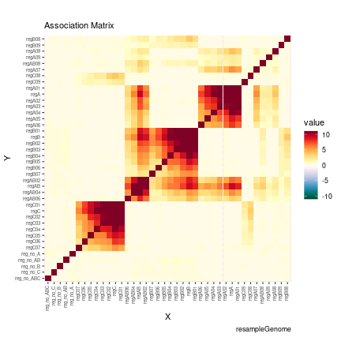

```r
#plotCrosswiseMatrix(cw_Alien_cRaR,matrix.type = "crosswise",maxVal = 0.7,ord_mat = ord)
#plotCrosswiseMatrix(cw_Alien_ReR,matrix.type = "crosswise",maxVal = 0.7,ord_mat = ord)

#plotCrosswiseMatrix(cw_Alien_RaR,matrix.type = "correlation",maxVal = 0.7,ord_mat = ord)
plotCrosswiseMatrix(cw_Alien_ReG,matrix.type =  "correlation" ,ord_mat = ord)
```

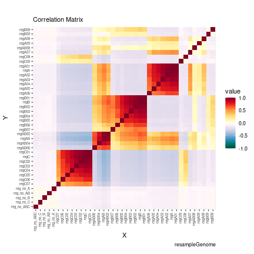

```r
#plotCrosswiseMatrix(cw_Alien_cRaR,matrix.type =  "correlation",maxVal = 0.7,ord_mat = ord)
#plotCrosswiseMatrix(cw_Alien_ReR,matrix.type =  "correlation",maxVal = 0.7,ord_mat = ord)
```

## Plot Single permutation test result

with the function plotSinglePT is possible to plot the association between two regions set form a gMXR object


```r
plotSinglePT(cw_Alien_ReG, RS1 = "regA","regA05")
```

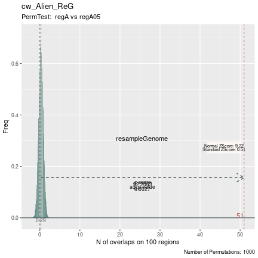

```r

plotSinglePT(cw_Alien_ReG, RS1 = "regA","regC")
```

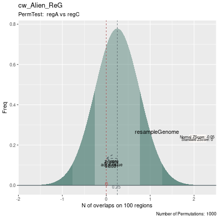

```r

plotSinglePT(cw_Alien_ReG, RS1 = "regA","reg_no_A")
```

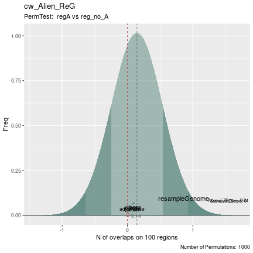

## Plot Dimensionally Reduction

```r
cw_Alien_ReG_s <- makeCrosswiseMatrix(cw_Alien_ReG,scale = TRUE)
#> [1] "method selected for hclustering: average"
#>  complete   average    single   ward.D2    median  centroid  mcquitty 
#> 0.8777835 0.9159616 0.8563762 0.7310281 0.6021711 0.7662813 0.8982519

set.seed(67)
plotCrosswiseDimRed(cw_Alien_ReG_s, nc = 5, type="PCA")
```

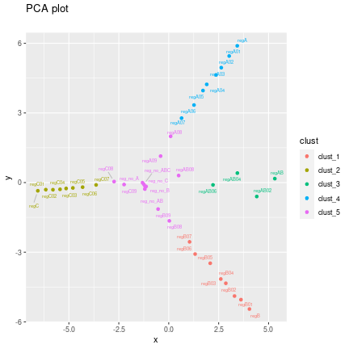


```r
set.seed(67)
plotCrosswiseDimRed(cw_Alien_ReG_s, nc = 5, type="PCA",ellipse = TRUE)
```

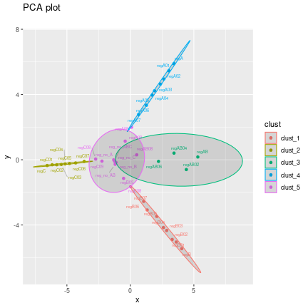


```r
lsRegSet<-list(regA="regA",regB="regB",regC="regC")

set.seed(67)
plotCrosswiseDimRed(cw_Alien_ReG_s, nc = 5, type="PCA",listRS = lsRegSet)
```

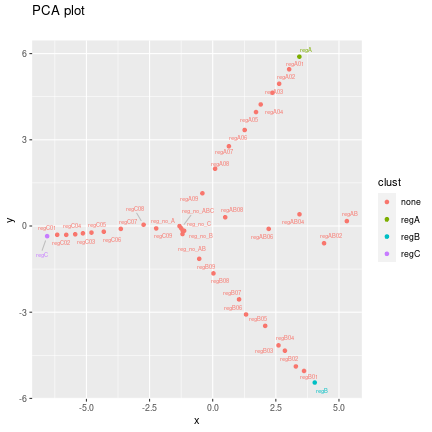

```r

set.seed(67)
plotCrosswiseDimRed(cw_Alien_ReG_s, nc = 5, type="PCA",listRS = lsRegSet,ellipse = TRUE, emphasize =TRUE)
```

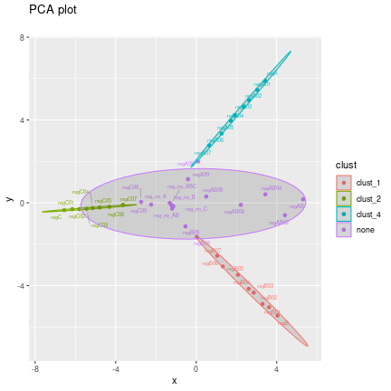


```r
set.seed(67)
plotCrosswiseDimRed(cw_Alien_ReG_s, nc = 5, type="tSNE",listRS = lsRegSet,ellipse = TRUE, emphasize =TRUE)
```

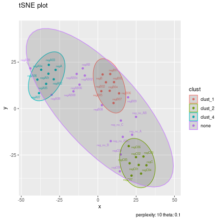


```r
set.seed(67)
plotCrosswiseDimRed(cw_Alien_ReG_s, nc = 5, type="UMAP",listRS = lsRegSet,ellipse = TRUE, emphasize =TRUE)
```

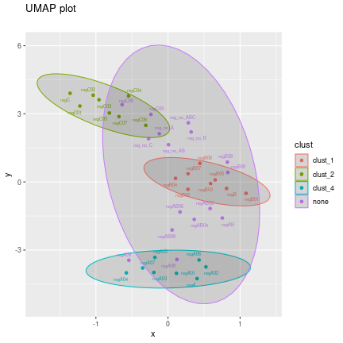


# Multi Local Zscore

Descrizione


```r

#NOT RUN
mlz_Alien_ReG<-multiLocalZscore(A = AlienRSList$regA,
                 Blist = AlienRSList,
                 ranFUN = "resampleGenome",
                 evFUN = "numOverlaps",
                 window = 100,
                 step = 1,
                 max_pv =1,
                 genome = AlienGenome,
                 mc.cores = 25)
```


```r
str(mlz_Alien_ReG)
```
creare la matrice


```r
mlz_Alien_ReG <- makeLZMatrix(mlz_Alien_ReG)
#> [1] "method selected for hclustering: average"
#>  complete   average    single   ward.D2    median  centroid  mcquitty 
#> 0.8952554 0.9259947 0.8700219 0.9236324 0.9256757 0.9231659 0.9227497
#> Warning in cor(x = t(mat), method = "pearson"): the standard deviation is zero
#> [1] "method selected for hclustering: average"
#>  complete   average    single   ward.D2    median  centroid  mcquitty 
#> 0.8861802 0.8901741 0.8393931 0.8673966 0.8817556 0.8853322 0.8889412
```
plotting

```r
plotLocalZScoreMatrix(mlz_Alien_ReG, maxVal = "max")
```

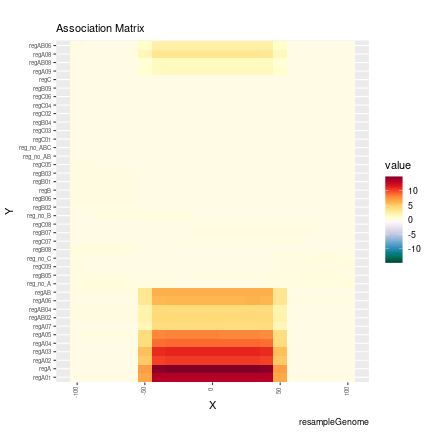
