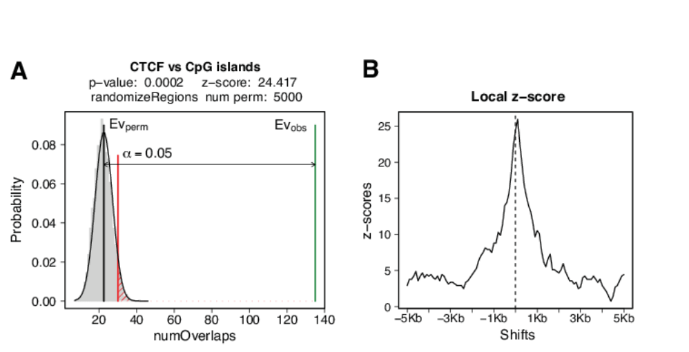
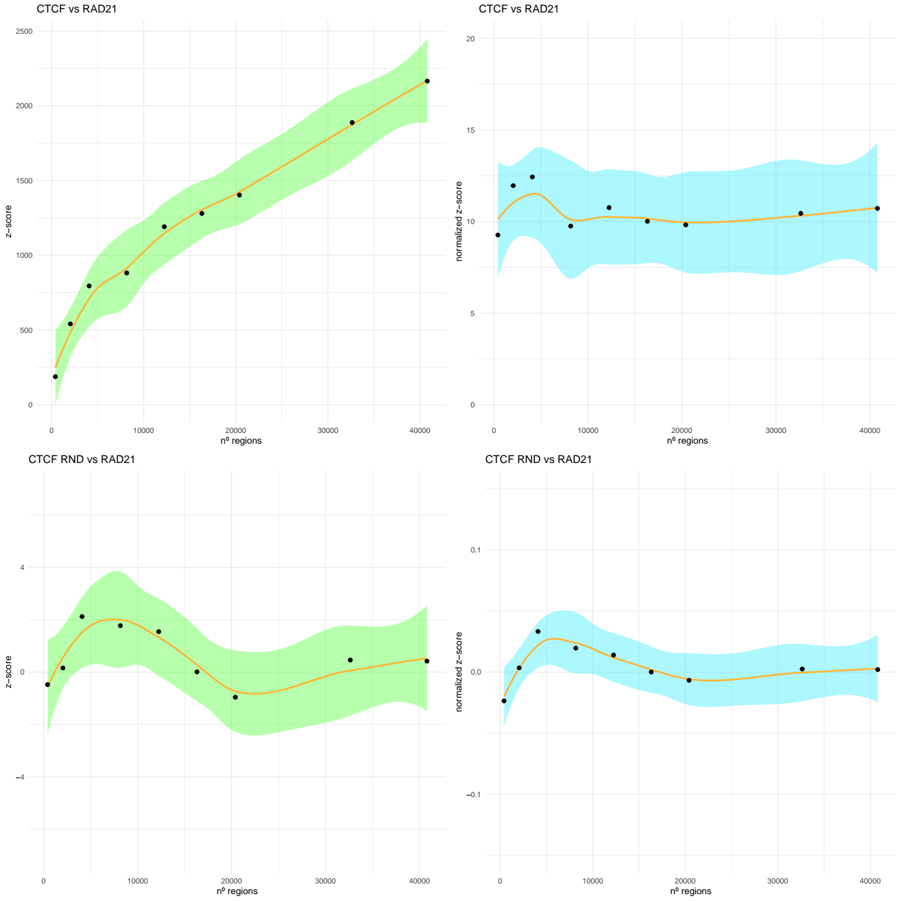
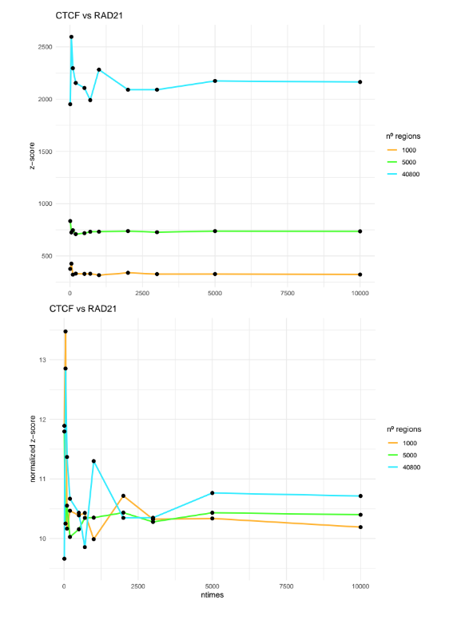
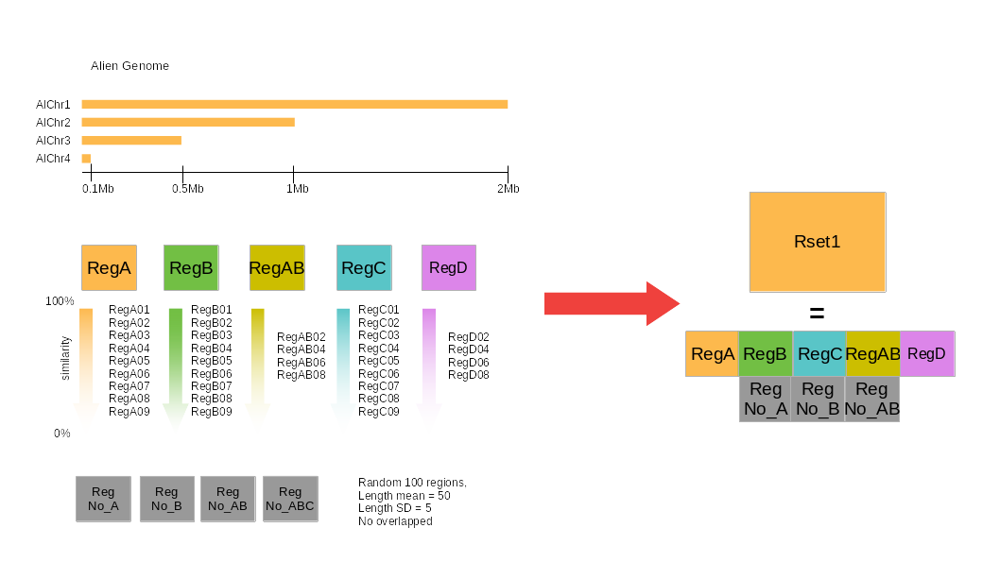

```{r, include = FALSE}
knitr::opts_chunk$set(
  collapse = TRUE,
  comment = "#>",
 fig.width=6, 
 fig.height=6,
 fig.align = "center"
)
```

```{r style, echo = FALSE, results = 'asis'}
BiocStyle::markdown()
```


# Introduction

In genetic and epigenetic research, high-throughput sequencing methods generate large amounts of data. The meaningful interpretation is one of the biggest challenges when analyzing multiple genomic datasets.

Sequencing results can be summarized as ‘region sets’: a list of genomic regions defined by specific coordinates in a reference genome. This is true for all frequently used epigenomic methods such as chromatin immuprecipation (ChIP)-seq, CUT&RUN, DNA-methylation profiling and chromosome conformation capture-based methods. Genome-sequencing studies provide information on mutations, copy number variations and inversions that can be expressed as region sets. Transcriptomic data can be converted in region sets for instance by extracting the genomic position of differentially expressed genes or their regulatory elements. All regions can be further associated with metadata further characterizing them. Any annotated feature of interest in the genome itself, such as repetitive elements, conserved regions, or regulatory elements, can be chosen as regions set for further analysis.

To interpret the meaning of overlaps between regions sets, in 2015 we published `r BiocStyle::Biocpkg("regioneR")`, an R package developed for the statistical evaluation of the association between sets of genomic regions. The main limitation of regioneR was that it can only perform pairwise association analysis. The resulting association value ("z-score") of different pairwise analyses could not be directly compared since z-scores depend on the size and nature of the input region sets. When scaling up the number of pairwise comparisons of larger data sets, the required increase in calculation time becomes a serious limitation.

To address these issues, we now present `r BiocStyle::Rpackage("regioneReloaded")`: an R package that is the logically designed evolution of `r BiocStyle::Biocpkg("regioneR")` allowing to calculate the statistical association between multiple regions sets at the same time. `r BiocStyle::Rpackage("regionReloaded")` comprises a set of functions created to analyze clusters of associations and to facilitate the interpretation of results. Importantly, it includes strategies to improve p-value calculations and provides normalized z-scores allowing the direct comparison of multiple analysis. It also builds upon `r BiocStyle::Biocpkg("regioneR")` by adding new plotting functions for obtaining publication-ready graphs.

Taken together, `r BiocStyle::Rpackage("regioneReloaded")`, aims to be a novel and valuable addition to the repertoire of available tools in the Bioconductor repository for the analysis of high-content genomic datasets.

## regioneR and regioneReloaded

`r BiocStyle::Biocpkg("regioneR")` is an R package published in 2015 created to statistically test the positional association between genomic region sets. The core of `r BiocStyle::Biocpkg("regioneR")` is a permutation test framework specifically designed to work in a genomic environment. For a detailed insight into the permutation test strategy implemented in `r BiocStyle::Biocpkg("regioneR")`, including the different randomization and evaluation strategies, please see the [regioneR vignette](https://bioconductor.org/packages/release/bioc/vignettes/regioneR/inst/doc/regioneR.html). The two main results that can be obtained with this statistical method can be summarized in two graphs. Figure 1A shows the association observed between the two region sets under study, highlighting the distance calculated in standard deviations from the random distribution. Figure 1B shows the local z-score: a narrow peak, as the one shown, indicates that the association is highly dependent on the exact location of the region. One the contrary, a flat profile would suggest a regional association.

(figure 1)

{width=120%}

## Normalized Z-Score

`r BiocStyle::Rpackage("regioneReloaded")` aims to integrate the framework previously developed for `r BiocStyle::Biocpkg("regioneR")` to calculate associations of different region sets simultaneously. However, the values of z-score obtained in different tests can not be directly compared. In particular, the value of the z-score is directly associated to the square root of the number of regions present in the first region set of the test (RS1). 

To compare the z-scores obtained in multi pairwise tests between region sets, we introduce the concept of **normalized z-score**, which allows not only to directly compare different association events but also to work with subsets of data and speed up the calculations.

The normalized z-score is calculated as follows:

nZS = ZS / $\sqrt{n}$

We can empirically evaluate how the value of z-score between two well known strongly associated proteins, CTCF (ENCFF237OKO) and RAD21 (ENCFF072UEX) in HepG2 cell line from ENCODE portal, (Sloan et al. 2016, https://www.encodeproject.org/) , increases with the number of regions included in the test. On the other hand, the value of the normalized z-score is much more stable with different number of regions. Importantly, we see that the value of normalized z-score is stable approximately after including only 30% of the regions in the dataset. This demonstrates than sampling a portion of the dataset is a viable strategy to reduce calculation time without impacting the capacity to obtain meaningful normalized z-score values.

{width=90%}

Another crucial factor for the calculation of the normal z-score is the number of permutations performed in the test (`ntimes`). We suggest to use a minimum of 5000 permutations to achieve reproducible results.

{width=90%}

# Installation

```{r, eval=FALSE}

if (!require("BiocManager", quietly = TRUE))
    install.packages("BiocManager")

BiocManager::install("regioneReloaded")

```


# Quick start

```{r setup}
library("regioneReloaded")
```

The permutation test can be performed on a list multiple region sets by the function `crosswisePermTest()`. This process is computing intensive and its calculation time depends on the  number of cores called by the parameter `mc.cores` (see `r BiocStyle::Biocpkg("regioneR")`). The result of the permutation test obtained by running the code below is included as a pre-computed example dataset which can be loaded into the environment by running the command `data("cw_Alien_RaR")`.

`AlienGenome` and `AlienRSList` are toy datasets described in the next section of the vignette. 

```{r load _data, eval=FALSE}
#NOT RUN
  
  set.seed(42)
  cw_Alien_ReG<-crosswisePermTest(Alist = AlienRSList_narrow,
                            sampling = FALSE,
                            mc.cores= 25,
                            ranFUN = "resampleGenome",
                            evFUN = "numOverlaps",
                            genome = AlienGenome,
                            ntimes= 1000
  )
#
```

Once the multiple permutation tests are performed, we can generate a matrix of pairwise associations between the region sets with the function `makeCrosswiseMatrix()` and visualize it with `plotCrosswiseMatrix()`.

```{r}

data("cw_Alien")

cw_Alien_ReG<-makeCrosswiseMatrix(cw_Alien_ReG, pvcut = 1)

plotCrosswiseMatrix(cw_Alien_ReG)

```

# Example dataset: the Alien Genome

Performing Permutation tests with region sets on an eukaryotic genome can take a long computation time. To demonstrate the different regionReloaded features on a small toy dataset with low computation times, we have created a fake genome called the 'AlienGenome' and an associated list of region sets. The Alien Genome consists of four chromosomes of  lengths ranging from 2Mb to 0.1Mb.

{width=100%}

```{r}

AlienGenome <-
  toGRanges(data.frame(
    chr = c("AlChr1", "AlChr2", "AlChr3", "AlChr4"),
    start = c(rep(1, 4)),
    end = c(2e6, 1e6, 5e5, 1e5)
  ))


```

Four basic region sets were created on this genome. The first three ("regA", "regB", "regC"), were created using the function `createRandomRegions()` from the package `r BiocStyle::Biocpkg("regioneR")`. Each region set consists of 100 regions with an average width of 100 bp (and a standard deviation of 50 bp). Being randomly generated, the three region sets should show no significant associations with each other.


```{r}
gnm <- AlienGenome

nreg=100

regA <-
  createRandomRegions(
    nregions = nreg,
    length.mean = 100,
    length.sd = 50,
    non.overlapping = TRUE,
    genome = gnm
  )

regB <-
  createRandomRegions(
    nregions = nreg,
    length.mean =  100,
    length.sd = 50 ,
    non.overlapping = TRUE,
    genome = gnm
  )

regC <-
  createRandomRegions(
    nregions = nreg,
    length.mean = 100,
    length.sd = 50,
    non.overlapping = TRUE,
    genome = gnm
  )

```

To generate "artificial" associations we can use the `similarRegionSet()` function, which produces sets of random regions with some degree of similarity to the original input region set. For each set of regions regA, regB and regC, we create a list of region sets that share a percentage (90% to 10%) of similarity with the original set.

```{r}

vectorPerc <- seq(0.1, 0.9, 0.1)

RsetA <-
  similarRegionSet(
    GR = regA,
    name = "regA",
    genome = gnm,
    vectorPerc = vectorPerc
  )
RsetB <-
  similarRegionSet(
    GR = regB,
    name = "regB",
    genome = gnm,
    vectorPerc = vectorPerc
  )
RsetC <-
  similarRegionSet(
    GR = regC,
    name = "regC",
    genome = gnm,
    vectorPerc = vectorPerc
  )

```

Next we create a region set of 100 regions that shares half the regions with regA and half with regB called regAB.  From this region set we create similar region sets again using `similarRegionSet()`.

```{r}

vectorPerc2 <- seq(0.2, 0.8, 0.2)
regAB <- c(sample(regA, nreg / 2), sample(regB, nreg / 2))
RsetAB <-
  similarRegionSet(
    GR = regAB,
    name = "regAB",
    genome = gnm,
    vectorPerc = vectorPerc2
  )

```

As a negative association control, we create random region sets that contain no regions of "regA", "regB", "regC", "regAB or "regABC" using `createRandomRegions()` and `substractRegions()` functions from  `r BiocStyle::Biocpkg("regioneR")`.

```{r}

reg_no_A <-
  createRandomRegions(
    nregions = nreg,
    length.mean = 100,
    length.sd = 50,
    non.overlapping = TRUE,
    genome = subtractRegions(gnm, regA)
  )

reg_no_B <-
  createRandomRegions(
    nregions = nreg,
    length.mean = 100,
    length.sd = 50,
    non.overlapping = TRUE,
    genome = subtractRegions(gnm, regB)
  )

reg_no_C <-
  createRandomRegions(
    nregions = nreg,
    length.mean = 100,
    length.sd = 50,
    non.overlapping = TRUE,
    genome = subtractRegions(gnm, regC)
  )

reg_no_AB <-
  createRandomRegions(
    nregions = nreg,
    length.mean = 100,
    length.sd = 50,
    non.overlapping = TRUE,
    genome = subtractRegions(gnm, c(regA, regB))
  )

reg_no_ABC <-
  createRandomRegions(
    nregions = nreg,
    length.mean = 100,
    length.sd = 50,
    non.overlapping = TRUE,
    genome = subtractRegions(gnm, c(regA, regB, regC))
  )

```

To demonstrate the detection of "lateral" association (association with a region close to the one being tested), we create the "regD" region set. It is composed of regions in the vicinity of region set "regA" but does not overlap with the regions of "regA" itself.

```{r}

dst <- sample(c(-300,300),length(regA),replace = TRUE)
regD <- regioneR::toGRanges(
                    data.frame(
                      chr=as.vector(GenomeInfoDb::seqnames(regA)),
                      start = start(regA) + dst,
                      end = end (regA) + dst
                      )
                    )

RsetD <-
  similarRegionSet(
    GR = regD,
    name = "regD",
    genome = gnm,
    vectorPerc = vectorPerc2
  )

```

Finally, we store all the generated sets of regions in a list called `AlienRSList` which we can use as input for the `crosswisePermTest()` function to perform the multiple permutation test.

```{r}

Rset_NO <- list(reg_no_A, reg_no_B, reg_no_C, reg_no_AB, reg_no_ABC)

names(Rset_NO) <- c("reg_no_A", "reg_no_B", "reg_no_C", "reg_no_AB", "reg_no_ABC")

AlienRSList_narrow <- c(RsetA, RsetB, RsetC, RsetD, RsetAB, Rset_NO)

summary(AlienRSList_narrow)

```

# Multi Permutation Test with regioneReloaded
## Crosswise Analysis and the genoMatriXeR object

`crosswisePermTest()` is the main statistical function of the package. "Crosswise" analysis (in contrast to "pairwise") refers to the calculation of permutation tests between all possible combinations of elements in a first list of region sets (`Alist`) with those in a second list (`Blist`). The core statistical calculations of the permutation tests rely on [permTest()](https://rdrr.io/bioc/regioneR/man/permTest.html). 

The result of `crosswisePermTest()` is stored in an S4 object of class `genoMatriXeR` that contains three slots: *parameters*, *multiOverlaps* and *matrix*.

* gMXR_obj
  + @parameters
    + Alist
    + Blist
    + sampling
    + fraction
    + min_sampling
    + ranFUN
    + evFUN
    + universe
    + adj_pv_method
    + max_pv
    + nc
    + matOrder
    + ntimes
  + @multiOverlaps
    + one field for each comparison
  + @matrix
    + GMat
    + GMat_pv
    + GMat_corX
    + GMat_corY
    + FitRow
    + FitCol


### Parameters

The slot "parameters" stores all the parameters that were used to obtain the `genoMatriXeR` object and can be retrieved with `getParameters()`.

```{r }

data("cw_Alien")
getParameters(cw_Alien_ReG)

```

### multiOverlaps

The "multiOverlaps" slot contains a list of data frames that contain the results of each permutation test performed. For each region set in "Alist", a data frame is generated with 11 columns and a number of rows equal to the elements in "Blist". The columns of the data frame contain the following information:

+ **order.id:**        order of comparison
+ **name:**            name of region sets in Blist  
+ **n_regionA:**       number of permuted Alist regions
+ **n_regionB:**       number of regions in each regions set of Blist 
+ **z_score:**         z-score calculated by [permTest](https://rdrr.io/bioc/regioneR/man/permTest.html)
+ **p_value:**         p.value calculated by [permTest](https://rdrr.io/bioc/regioneR/man/permTest.html)
+ **n_hits:**          number of hits computed using the evaluation function on a regions set of Alist versus each regions set of Blists
+ **mean_perm_test:**  mean of hits computed using the evaluation function on the permutated region set
+ **sd_perm_test:**    standard deviation of hits computed using the evaluation function on the permutated region set
+ **norm_zscore:**     normalized z-scores 
+ **adj_p_value:**     adjusted p.value 

### Matrix

When the genoMatriXeR object is initially created by running `crosswisePermTest()`, the "matrix" slot will have a NULL value. See the section [Matrix calculation and visualization] on how to generate, access and visualize the association matrix.

## Evaluation functions

`r BiocStyle::Rpackage("regioneReloaded")` can use all the evaluation strategies present in `r BiocStyle::Biocpkg("regioneR")`, and it also allows the use of custom evaluation functions. The examples considered by this vignette will be based on the default evaluation function `numOverlaps()`.

## Randomization functions

`r BiocStyle::Rpackage("regioneReloaded")` can use all the randomization strategies present in `r BiocStyle::Biocpkg("regioneR")` and  it also allows the use of custom functions.

A notable difference with regioneR is that the randomization function `resampleRegions()` can work without the presence of the parameter "universe". In this case a "universe" will be created by using all regions from the list of regions set "Alist" using the function `createUniverse()`. Three example pre-computed objects are included as sample data generated with three different randomization functions: "randomizeRegions", "resampleRegions" and "resampleGenome".


```{r, eval=FALSE}

#NOT RUN

set.seed(42)
cw_Alien_RaR <-  crosswisePermTest(
  Alist = AlienRSList_narrow,
  Blist = AlienRSList_narrow,
  sampling = FALSE,
  genome = AlienGenome,
  per.chromosome=TRUE,
  ranFUN = "randomizeRegions",
  evFUN = "numOverlaps",
  ntimes= 1000,
  mc.cores = 20
)


set.seed(42)
cw_Alien_ReR <-  crosswisePermTest(
  Alist = AlienRSList_narrow,
  Blist = AlienRSList_narrow,
  sampling = FALSE,
  genome = AlienGenome,
  per.chromosome=TRUE,
  ranFUN = "resampleRegions",
  evFUN = "numOverlaps",
  ntimes= 1000,
  mc.cores = 20
)

set.seed(42)
cw_Alien_ReG <-  crosswisePermTest(
  Alist = AlienRSList_narrow,
  Blist = AlienRSList_narrow,
  sampling = FALSE,
  genome = AlienGenome,
  per.chromosome=TRUE,
  ranFUN = "resampleGenome",
  evFUN = "numOverlaps",
  ntimes= 100,
  mc.cores = 20
)

#

```

## Matrix Calculation and visualization

Association matrix will be computed with the function `makeCrosswiseMatrix()`. This function returns a *genoMatriXeR* object with the matrix assigned to the "matrix" slot, the matrix will be able to be queried with the `getMatrix()` function. As a default value the matrix will be created using *normalized z-score* for a more in-depth description of the parameters that can be used to create the matrix we refer you to the `makeCrosswiseMatrix()` function manual. If no clustering method is chosen, automatically the most efficient clustering method will be chosen from those in [hclust](https://www.rdocumentation.org/packages/stats/versions/3.6.2/topics/hclust), as described in the `chooseHclustMet()` function manual.

```{r}

cw_Alien_RaR <- makeCrosswiseMatrix(cw_Alien_RaR)

cw_Alien_ReG <- makeCrosswiseMatrix(cw_Alien_ReG)

cw_Alien_ReR <- makeCrosswiseMatrix(cw_Alien_ReR)

```

To compare the output of the matrices created with different randomization functions, we need to use the fixed order of clusterization for all matrices. 

```{r}

modX <- getHClust(cw_Alien_ReG,hctype = "rows")
modY <- getHClust(cw_Alien_ReG,hctype = "cols")


X<-modX$labels[modX$order]
Y<-modY$labels[modX$order]

ord<-list(X=X,Y=Y)

p_ReG <- plotCrosswiseMatrix(cw_Alien_ReG, matrix_type = "association", ord_mat = ord)
p_ReR <- plotCrosswiseMatrix(cw_Alien_ReR, matrix_type = "association", ord_mat = ord)


plot(p_ReG)
plot(p_ReR)

```

`getHClust()` function returns an object of class [hclust](https://www.rdocumentation.org/packages/stats/versions/3.6.2/topics/hclust) that you can use for further analysis.

```{r}

plot(modX,cex = 0.8)

```

the *matrix_type* parameter `plotCrosswiseMatrix()` allows to choose between "association" matrix (where the z-score value obtained from the permutation test calculation will be shown), or "correlation" (where the Pearson's R-value between each Regions Set will be used).

```{r}

p_ReG_cor <- plotCrosswiseMatrix(cw_Alien_ReG, matrix_type = "correlation", ord_mat = ord)
# p_ReR_cor <- plotCrosswiseMatrix(cw_Alien_ReR, matrix_type = "correlation", ord_mat = ord)

plot(p_ReG_cor)
# plot(p_ReR_cor)

```


## Plot Single permutation test 

`r BiocStyle::Rpackage("regioneReloaded")` allows us to extract and visualize the results of a single Region Sets comparison, the visualization resumes the previous graphs in `r BiocStyle::Biocpkg("regioneR")` by exploiting the power of `r BiocStyle::Biocpkg("ggplot2")`.

```{r}
plotSinglePT(cw_Alien_ReG, RS1 = "regA", RS2 = "regA_05")
```

```{r}
  p_sPT1 <- plotSinglePT(cw_Alien_ReG, RS1 = "regA", RS2 = "regC")

plot(p_sPT1)
```

## Plot Dimensionality Reduction

Dimensionality reduction refers to a strategy capable of representing complex (high-density) data in a low-density space while retaining some meaningful properties of the original data. The plotCrosswiseDimRes function allows three of the most widely used algorithms (PCA, tRSNE, UMAP) to be applied to represent genoMatriXeR objects.


```{r}

set.seed(42)

plotCrosswiseDimRed(cw_Alien_ReG, nc = 6, type="PCA")

```

The data is clustered using a clustering algorithm that can be selected from (`hclust`, `kmeans` or `pam` ), giving the possibility of importing an external clustering method.

```{r}
set.seed(42)
p_cdr_hc <- plotCrosswiseDimRed(cw_Alien_ReG, nc = 6, type="PCA", clust_met = "hclust")

# set.seed(42)
# p_cdr_pam <- plotCrosswiseDimRed(cw_Alien_ReG, nc = 6, type="PCA", clust_met = "pam")

plot(p_cdr_hc) 
# plot(p_cdr_pam)
          
```

The parameters *listRS* and *emphasize* were added to emphasise the data found to be interesting.

```{r}

lsRegSet<-list(regA="regA",regB="regB",regC="regC")

set.seed(42)
plotCrosswiseDimRed(cw_Alien_ReG, nc = 6, type="PCA",listRS = lsRegSet)

set.seed(42)
plotCrosswiseDimRed(cw_Alien_ReG, nc = 6, type="PCA",listRS = lsRegSet,ellipse = TRUE, emphasize =TRUE)

set.seed(67)
plotCrosswiseDimRed(cw_Alien_ReG, nc = 6, type="tSNE",listRS = lsRegSet,ellipse = TRUE, emphasize =TRUE)

set.seed(67)
plotCrosswiseDimRed(cw_Alien_ReG, nc = 6, type="UMAP",listRS = lsRegSet,ellipse = TRUE, emphasize =TRUE)

```
The * return_table* parameter displays a table summarising the results of the clustering, incorporating the value *ASW* total mean of individual silhouette widths [silohuette](https://www.rdocumentation.org/packages/cluster/versions/2.1.3/topics/silhouette).

```{r}
set.seed(67)
silTable <- plotCrosswiseDimRed(cw_Alien_ReG, nc = 6, type="UMAP",listRS = lsRegSet,return_table = TRUE)

silTable
```

# Multi Local Zscore

The [multiLocalZscore] function allows the association of a single regions Set against a list of regions Sets to be analysed by applying the [localZScore](https://rdrr.io/bioc/regioneR/man/localZScore.html) function in a neighbourhood defined by the *window* parameter a number of times defined by the *step* parameter.

```{r, eval=FALSE }

#NOT RUN
mlz_Alien_ReG<-multiLocalZscore(A = AlienRSList_narrow$regA,
                 Blist = AlienRSList_narrow,
                 ranFUN = "resampleGenome",
                 evFUN = "numOverlaps",
                 window = 100,
                 step = 1,
                 max_pv = 1,
                 genome = AlienGenome)
```


As with the `crosswisePermTest()` function, an object consisting of three slots *paremeters* *multiLocalZscores* and *matrix* will be created. These can be queried by the functions `getParametrs()`, `getMultiEvaluation()` and `getMatrix()` respectively. Again, the object thus created will have the matrix slot = NULL.

```{r}
getParameters(mLZ_regA_ReG)

mlz_Me <- getMultiEvaluation(rR = mLZ_regA_ReG )

head(mlz_Me$resumeTable)
```

The matrix will be created by the function `makeLZMatrix()` in a similar manner as illustrated for the function `makeCrosswiseMatrix()`. Again, it is possible to pass a clustering method to the function, and if not, the best clustering function calculated using `chooseHclustMet()` will be chosen.

```{r}

mLZ_regA_ReG <- makeLZMatrix(mLZ_regA_ReG)

plot(getHClust(mLZ_regA_ReG),cex = 0.8)
```
The `plotLocalZScoreMatrix()` function allows the visualisation of an object of class *multilocalZScore*. This type of visualization will also allow the association to be tested in the area adjacent to the tested Region Set. 

```{r}
plotLocalZScoreMatrix(mLZ_regA_ReG, maxVal = "max")
```
## Single Local ZScore

Similarly to as seen above for the `plotSinglePT()` function, the `plotSingleLZ()` function allows us to specifically display single associations drawn from a *multiLocalZScore* object.
```{r}
plotSingleLZ(mLZ = mLZ_regA_ReG, RS =c("regA"), smoothing = TRUE)
```

It is also possible to simultaneously display multiple associations in the same graph by introducing a vector of region set names

```{r}
plotSingleLZ(mLZ = mLZ_regA_ReG,RS =c("regA","regA_02","regA_06","regA_08","regD"),smoothing = TRUE)
```


# Analyses of non-square matrices

`r BiocStyle::Rpackage("regioneReloaded")` allows the association of Regions Sets of any length to be calculated. *AlienRSList_broad* is a list of Region Set created from *AlienRSList_narrow*, in which the [extendRegions](https://rdrr.io/bioc/regioneR/man/extendRegions.html) function has increased the width to an average of 5kb, to complete *AlienRSList_broad* a set of random region sets was added (RegR).
```{r}
# average of the widths of AlienRSList_narrow
do.call("c",lapply(lapply(AlienRSList_narrow, width),mean))
# average of the widths of AlienRSList_broad
do.call("c",lapply(lapply(AlienRSList_broad, width),mean))
```

```{r eval=FALSE}

##NOT RUN
cw_Alien_RaR_no_Square <-  crosswisePermTest(
  Alist = AlienRSList_narrow,
  Blist = AlienRSList_broad,
  sampling = FALSE,
  genome = AlienGenome,
  per.chromosome=TRUE,
  ranFUN = "resampleGenome",
  evFUN = "numOverlaps",
  ntimes= 100,
  mc.cores = 6
)

###
```

the matrix calculated in this case is based on a double clustering of rows and columns

```{r}
cw_Alien_ReG_no_Square <- makeCrosswiseMatrix(cw_Alien_ReG_no_Square)

plotCrosswiseMatrix(cw_Alien_ReG_no_Square)
```

In this case, the `multiLocalZscore()` function works in exactly the same way as in the previous cases, but in order to see the form of the association, it is recommended to enlarge *window* parameter.

```{r, eval=FALSE}

#NOT RUN
mLZ_regA_ReG_br<-multiLocalZscore(A = 
                                    AlienRSList_narrow$regA, 
                                  Blist = AlienRSList_broad, 
                                  ranFUN = "resampleGenome",
                                  genome = AlienGenome,
                                  window = 5000,
                                  step =100)
##
```
```{r}
mLZ_regA_ReG_br<-makeLZMatrix(mLZ_regA_ReG_br)

plotLocalZScoreMatrix(mLZ_regA_ReG_br)
```


```{r}
plotSingleLZ(mLZ = mLZ_regA_ReG_br,RS =c("regA_br","regA_br_02","regA_br_06","regA_br_08","regD_br"), smoothing = TRUE)

```


# Session Info
```{r, sessionInfo}
sessionInfo()
```

