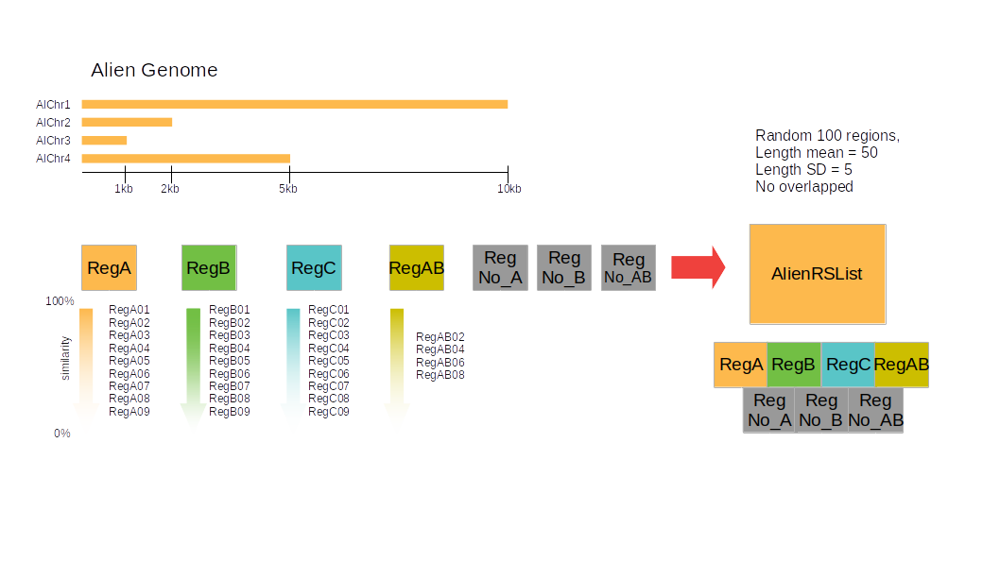

```{r, include = FALSE}
knitr::opts_chunk$set(
  collapse = TRUE,
  comment = "#>",
 fig.width=6, 
 fig.height=6,
 fig.align = "center"
)
```

```{r style, echo = FALSE, results = 'asis'}
BiocStyle::markdown()
```


```{r setup}
library("regioneRld")
```

# regioneRld

The meaningful interpretation of overlaps between binding profiles of multiple 
chromatin regulators is a major challenge in epigenomics. To address this, 
in 2015 we published `r BiocStyle::Biocpkg("regioneR")` an R package that we developed for statistically  
assessing the association between genomic regions sets. Here, we now present the 
regioneRld, an R package that is the natural evolution of `r BiocStyle::Biocpkg("regioneR")` and allows to 
calculate the statistical association between multiple regions sets at the same 
time. RegioneRld is designed to work with multiple region set associations at 
the same time. To compare z-scores coming from multiple analysis, different 
strategies have been introduced to normalize the z-score and to improve the 
p-value calculations. Taken together, regioneRld aims to be a novel and precious 
addition to NGS tools and for whole genome analysis.


### regioneR limitations

`r BiocStyle::Biocpkg("regioneR")` is an R package created to test the associations between genomic region 
sets. The core of `r BiocStyle::Biocpkg("regioneR")` is a permutation test framework specifically designed 
to work in a genomic environment. The two main results can be summarized in two 
graphs. Figure 1A shows the association between the two region sets under study, 
highlighting the distance calculated in standard deviations from the random 
distribution. Figure 1B shows the local z-score, while a flat profile suggests a 
regional association, a narrow peak, as the one shown, indicates that the 
association is highly dependent on the exact location of the region.

(figure 1)

### Normalized Z-S

nZS = ZS / $\sqrt{n}$

regioneRld aims to integrate the framework previously developed for `r BiocStyle::Biocpkg("regioneR")`, 
to calculate associations of different region sets simultaneously. To compare
associations deriving from different region sets, we introduce the concept of 
normalized z-score, which allows not only to compare different association 
events but also to work with subsets of data and speed up the calculations.

(figure 2)

# Quick start

to calculate a crosswisePermTest starting from a list of Region Sets we can use 
the following code, the permutation process is time expensive and depend to a 
number of cores called by the parameter \code{\link{mc.cores}} (see `r BiocStyle::Biocpkg("regioneR")`)
The results of a follow code is state in the data folder of the package, to load in to the enviroment
use the command data("cw_Alien_RaR").
AlienGenome and AlienRSList arte described in the vignette  

```{r load _data, eval=FALSE}
#NOT RUN
  set.seed(42)
  cw_Alien_RaR<-crosswisePermTest(Alist = AlienRSList,
                            sampling = FALSE,
                            mc.cores= 15,
                            ranFUN = "randomizeRegions",
                            evFUN = "numOverlaps",
                            genome = AlienGenome,
                            ntimes= 1000
  )
#
```

```{r}
library(regioneR)
library(RColorBrewer) # now we can delete this

data("cw_Alien_RaR")


cw_Alien_RaR<-makeCrosswiseMatrix(cw_Alien_RaR,pvcut = 1)

plotCrosswiseMatrix(cw_Alien_RaR,matrix.type = "crosswise",maxVal = 0.7)

plotCrosswiseMatrix(cw_Alien_RaR,matrix.type = "correlation",maxVal = 0.7)
```


### Alien Genome and Alien RegionSet List

calculate the associations between genomic regionset can be very time consuming, 
to reduce the time of calculation and to better understand the interpretation of 
the regioneRld results, we create a fake genome of 4 chromosomes that we call 
Alien genome.

{width=85%}

```{r}

library("regioneRld")

```


```{r}

AlienGenome <-
  toGRanges(data.frame(
    chr = c("AlChr1", "AlChr2", "AlChr3", "AlChr4"),
    start = c(rep(1, 4)),
    end = c(1e4, 2e3, 1e3, 5e3)
  ))

```
We create 3 regionSet on AlienGenome each one of 100 region an called "regA","regB" and "regC"

```{r}
gnm <- AlienGenome

nreg=100

regA <-
  createRandomRegions(
    nregions = nreg,
    length.mean = 50,
    length.sd = 5,
    non.overlapping = TRUE,
    genome = gnm
  )

regB <-
  createRandomRegions(
    nregions = nreg,
    length.mean = 50,
    length.sd = 5,
    non.overlapping = TRUE,
    genome = gnm
  )

regC <-
  createRandomRegions(
    nregions = nreg,
    length.mean = 50,
    length.sd = 5,
    non.overlapping = TRUE,
    genome = gnm
  )

```
Using the regioneRld function similarRegionSet.R we create for each regionset 9
different regionset that shares a percentage (from 90 to 10) with the original one
```{r}

vectorPerc <- seq(0.1, 0.9, 0.1)

RsetA <-
  similarRegionSet(
    GR = regA,
    name = "regA",
    genome = gnm,
    vectorPerc = vectorPerc
  )
RsetB <-
  similarRegionSet(
    GR = regB,
    name = "regB",
    genome = gnm,
    vectorPerc = vectorPerc
  )
RsetC <-
  similarRegionSet(
    GR = regC,
    name = "regC",
    genome = gnm,
    vectorPerc = vectorPerc
  )

```

Using the same approach we create a regionset that share half a regions of regA 
and half of regB, from this region set we create a list of similar regions set using vectorPerc2

```{r}
vectorPerc2 <- seq(0.2, 0.8, 0.2)
regAB <- c(sample(regA, nreg / 2), sample(regB, nreg / 2))
RsetAB <-
  similarRegionSet(
    GR = regAB,
    name = "regAB",
    genome = gnm,
    vectorPerc = vectorPerc2
  )

```
last step is to create random RSs that not contain regions of regA, regB, regC, 
regAB and put all this regionsets in a unique regionSet List called AlienRSList

```{r}
reg_no_A <-
  createRandomRegions(
    nregions = nreg,
    length.mean = 10,
    length.sd = 5,
    non.overlapping = TRUE,
    genome = subtractRegions(gnm, regA)
  )

reg_no_B <-
  createRandomRegions(
    nregions = nreg,
    length.mean = 10,
    length.sd = 5,
    non.overlapping = TRUE,
    genome = subtractRegions(gnm, regB)
  )

reg_no_C <-
  createRandomRegions(
    nregions = nreg,
    length.mean = 10,
    length.sd = 5,
    non.overlapping = TRUE,
    genome = subtractRegions(gnm, regC)
  )
reg_no_AB <-
  createRandomRegions(
    nregions = nreg,
    length.mean = 10,
    length.sd = 5,
    non.overlapping = TRUE,
    genome = subtractRegions(gnm, c(regA, regB))
  )

Rset_NO <- list(reg_no_A, reg_no_B, reg_no_C, reg_no_AB)

names(Rset_NO) <- c("reg_no_A", "reg_no_B", "reg_no_C", "reg_no_AB")

RsetAB <-
  similarRegionSet(
    GR = regAB,
    name = "regAB",
    genome = gnm,
    vectorPerc = vectorPerc2
  )

AlienRSList <- c(RsetA, RsetB, RsetC, RsetAB, Rset_NO)

summary(AlienRSList)

```
## Multi Permutation Test 
### Crosswise Analysis

CrosswisePermTest a package's core function, using it is possible to calculate the 
permutation test between all the combination of two RSs. Results of this function is an S4 object of class gMXR,
it contains 3 in three slots, *parameters*, *multiOverlaps* and *matrix*

* gMXR_obj
  + @parameters
    + Alist
    + Blist
    + sampling
    + fraction
    + min_sampling
    + ranFUN
    + evFUN
    + universe
    + adj_pv_method
    + max_pv
    + nc
    + matOrder
    + ntimes
  + @multiOverlaps
    + one field for each comparison
  + @matrix
    + GMat
    + GMat_pv
    + GMat_corX
    + GMat_corY
    + FitRow
    + FitCol


#### Parameters

In the slot "parameters" are present all the paramenteres used to obtain  the 
gMXR object."
```{r }
data("cw_Alien_RaR")
print(cw_Alien_RaR@parameters)
```
#### multiOverlaps

"multiOverlaps" slot contain a list of data frames.
For each element of Alist, will be create a data frame with 12 column and a nuber of rows equal to ther number of element present in Blist.
the 12 columns of the data frame represent:

+ order.id:       order of comparison
+ name:           name of Blist element 
+ n_regionA       number of regions od Alist using in the permutation test
+ n_regionB       number of regions od Blist using in the permutation test
+ z_score         calucalted z-score of permutation test
+ p_value         p.value of permutation test
+ n_overlaps      number of hits between Alist element and Belement (change name) 
+ mean_perm_test  mean of hits of permutated region set
+ sd_perm_test    standard deviation of hits in permutated region set
+ norm_zscore     z-scores normalized
+ std_zscore      z-score standardized* (maybe is better to eliminate)
+ adj_p_value     p.value adjusted 


```{r}
print(head(cw_Alien_RaR@multiOverlaps$regA01))
```
#### matrix
when gMXR object is created the slot matrix will be NULL
```{r}
print(cw_Alien_RaR@matrix)
```

#Evaluation functions
regioneReload can use all the evaluation strategies present in
`r BiocStyle::Biocpkg("regioneR")` 

#Randomization functions
regioneReload can use all the randomization strategies present in
`r BiocStyle::Biocpkg("regioneR")` 
but we introduce new approaches\Rfunction{findOverlaps}

